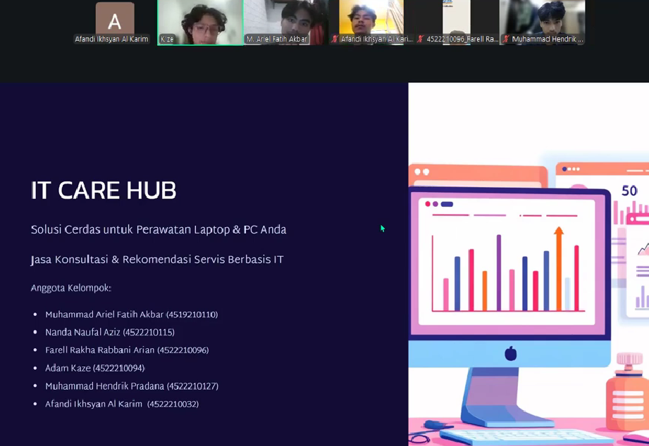

# 🛠️ IT Care Hub
> **Smart IT Consultation & Trusted Laptop Service Mediator**  
> *“Solusi Tepat untuk Kerusakan Perangkat, Tanpa Kebingungan”*

---

## 📌 Tentang IT Care Hub
**IT Care Hub** adalah layanan **jasa konsultasi IT dan perantara service laptop/PC** yang berperan sebagai **pihak ketiga (mediator)** antara pelanggan dan mitra tempat service terpercaya.

Kami membantu pengguna untuk:
- Memahami jenis kerusakan perangkat (hardware / software)
- Menghindari overprice dan praktik service yang tidak transparan
- Menemukan tempat service yang sesuai dan terpercaya
- Menentukan apakah perangkat masih layak diperbaiki atau lebih baik diganti

---

## 👥 Tim Pengembang
| Nama | NIM |
|------|-----|
| Muhammad Ariel Fatih Akbar | 4519210110 |
| Nanda Naufal Aziz | 4522210115 |
| Farell Rakha Rabbani Arian | 4522210096 |
| Adam Kaze | 4522210094 |
| Muhammad Hendrik Pradana | 4522210127 |
| Afandi Ikhsyan Al Karim | 4522210032 |

---

## 🔍 1. Validasi Lapangan (Field Validation)
Sebagai dasar pengembangan solusi, tim IT Care Hub telah melakukan **validasi lapangan** melalui wawancara langsung dengan **6 responden** yang relevan dengan target pengguna layanan ini.

### 🧩 Permasalahan Utama
Hasil validasi menunjukkan beberapa permasalahan umum yang sering dialami pengguna laptop/PC:

- **Kurangnya Pengetahuan Teknis**  
  Pengguna kesulitan mengidentifikasi apakah masalah berasal dari hardware atau software.

- **Ketakutan Akan Penipuan & Overpricing**  
  Banyak pengguna ragu terhadap transparansi harga dan kualitas layanan tempat service.

- **Kesulitan Memilih Tempat Service Terpercaya**  
  Banyaknya pilihan justru membuat pengguna bingung menentukan yang terbaik.

- **Dilema Repair vs Replace**  
  Pengguna tidak mengetahui apakah biaya perbaikan masih sepadan dibanding membeli perangkat baru.

### 💡 Solusi dari IT Care Hub
Untuk menjawab permasalahan tersebut, IT Care Hub menawarkan:

- **Jasa Konsultasi IT Online**  
  Analisis awal kerusakan laptop/PC melalui chat atau form online.

- **Diagnosis Awal & Tingkat Urgensi**  
  Penilaian tingkat kerusakan dan prioritas penanganan.

- **Estimasi Biaya & Kelayakan Perbaikan**  
  Membantu pengguna mengambil keputusan yang rasional dan efisien.

- **Rekomendasi Mitra Service Terpercaya**  
  Berdasarkan lokasi, spesialisasi kerusakan, dan reputasi mitra.

📄 **Dokumentasi Validasi Lapangan:**  
👉 https://docs.google.com/document/d/1fPx_-_OyWRWR7tcxa7ENrB_KGR7hOwifdu0F52SYwak/edit

---

## 📊 2. Model Bisnis & Arsitektur Keuangan
IT Care Hub dirancang sebagai **startup berbasis jasa (service-based business)** dengan fokus pada efisiensi biaya dan skalabilitas.

### 📈 Ringkasan Keuangan
- **Modal Awal:** Rp 10.000.000  
- **Break Even Point (BEP):** Bulan ke-5  
- **Laba/Rugi Bulan ke-3:** Rp -2.063.000 *(fase investasi awal)*  

📑 **Dokumen Perhitungan Keuangan Lengkap:**  
👉 https://docs.google.com/spreadsheets/d/14tRtobCDRUcbk8bqb80ouaGRmbts0z_fXv9enPIzgmE/edit

*(Memuat perhitungan HPP, BEP, Arus Kas, Laba Rugi, dan Neraca dengan formula aktif)*

---

## 📺 3. Presentasi Produk (Pitch Deck)
Penjelasan lengkap mengenai konsep, potensi bisnis, dan strategi IT Care Hub dapat disimak melalui video pitching berikut:

---

## 🚀 Penutup
IT Care Hub hadir sebagai **jembatan kepercayaan** antara pengguna dan penyedia layanan IT.  
Dengan pendekatan berbasis konsultasi, transparansi, dan teknologi, kami berkomitmen untuk memberikan solusi service laptop/PC yang lebih aman, jelas, dan terpercaya.
